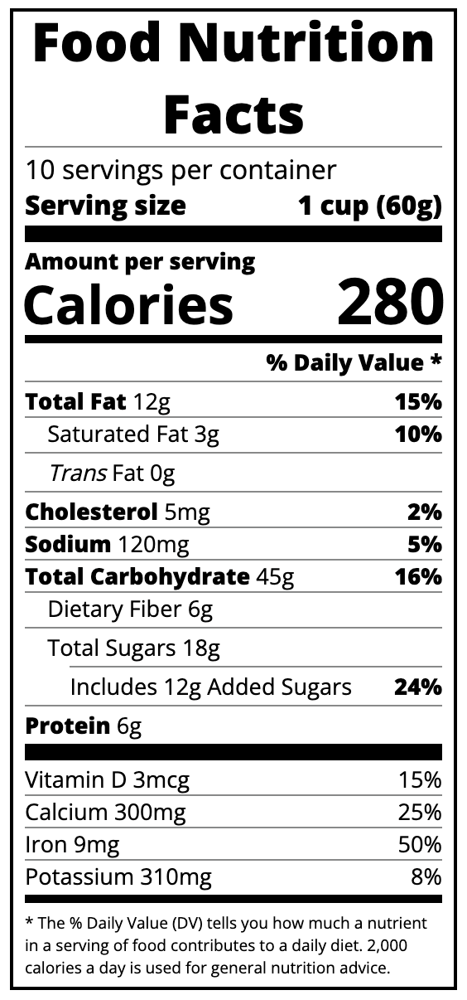

# Nutrition Label Project

This project is a simple food nutrition label made with HTML and CSS. It shows information like calories, fats, carbohydrates, and other nutrients per serving.

## Screenshot

## Features

Shows a clear and simple nutrition label.
Displays calories, fats, carbs, sugars, and protein.

- **Typography**: Uses the "Open Sans" font from Google Fonts for a modern and clean look.
- **CSS Flexbox**: Utilizes CSS Flexbox for layout and alignment of elements.
- **Nutrition Information**: Shows the daily percentage values for each nutrient.Includes Vitamin D, Calcium, Iron, and Potassium.

## Technologies Used

- **HTML**: Used for structuring the content of the nutrition label.
- **CSS**: Used for styling the label, including typography, spacing, and layout.